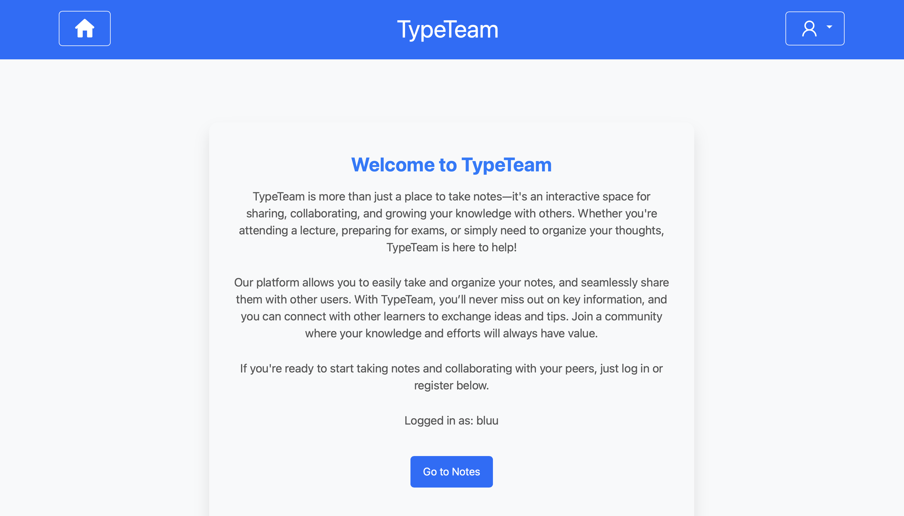
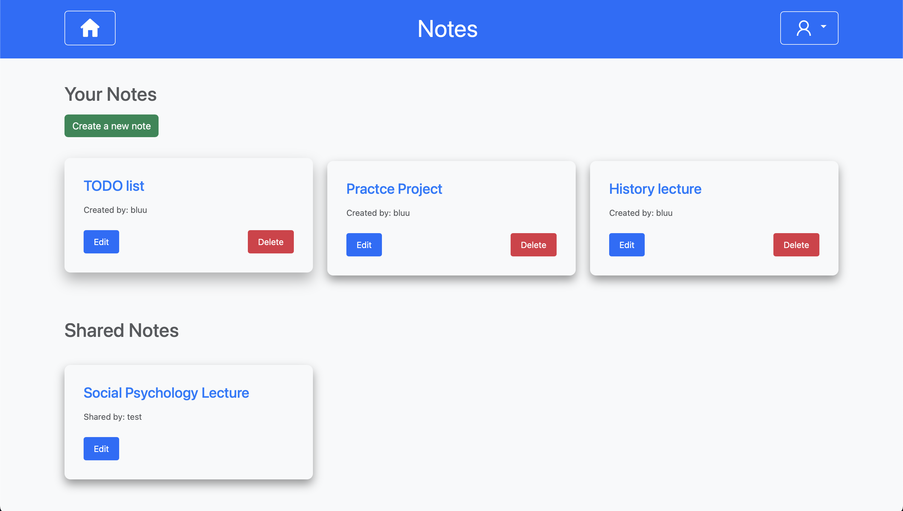
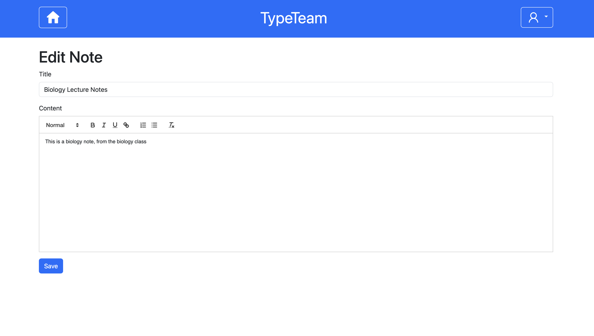

# TypeTeam - Notes Application

TypeTeam is a web application that allows users to create, manage, and share notes with others. Built with **Spring Boot**, featuring bcrypt password hashing, and role-based access.





## Features

- **User Authentication**: Users can register and log in, passwords are stored using **bcrypt** hashing


- **CRUD operations**: Users can create, view, edit, and delete notes. Admins can manage the roles of users.


- **Sharing Notes**: Notes can be shared with other users.


- **Role-based Access**: The application includes basic role management for role-based access.

## Technologies Used

- **Spring Boot**: Backend framework for building the application.
- **Spring Security**: For user authentication and security.
- **Spring Data JPA**: For data persistence with the database.
- **Thymeleaf**: Template engine for rendering HTML views.
- **Oracle MYSQL**: database for storing user, role and note data.
- **Bootstrap, CSS**: Styling.
- **bcrypt**: Used for securely hashing and storing passwords.

## Requirements

- Java 17 or newer
- Maven
- MySQL Workbench, (Community Server)

## Setup and Installation

1. **Clone the repository:**

   ```bash
   git clone https://github.com/yourusername/typeteam.git
   cd typeteam
   ```

2. **Run the SQL script in resources/sql-scripts**

3. **Create the database.properties file in the resources folder. Example of how to set it up:**
4. ```bash
   spring.datasource.url=jdbc:mysql://localhost:3306/TypeTeam
    spring.datasource.username=yourusername
    spring.datasource.password=yourpassword
   ```
   
